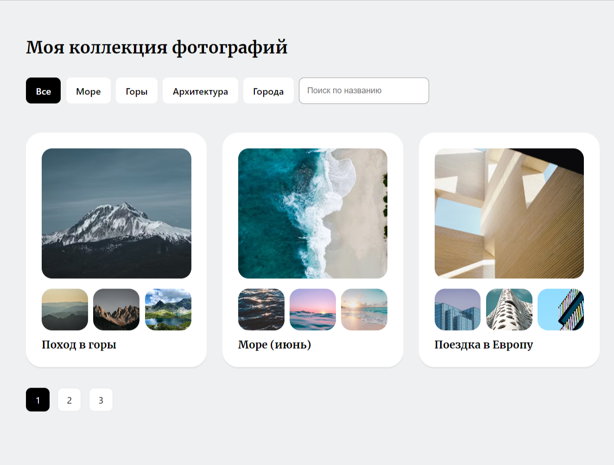

Коллекция фотокарточек.   

В данном проекте я сделал массив данных и с помощью Mockapi реализовал запрос к Api.    
Реализовано:    
1. Рендер карточек по 3 на страницу.    
2. Переход по страницам с карточками.    
3. Разделы карточек по категориям, где переходя на категорию они фильтруются по названию.    
4. Живой поиск по названиям карточек.    

